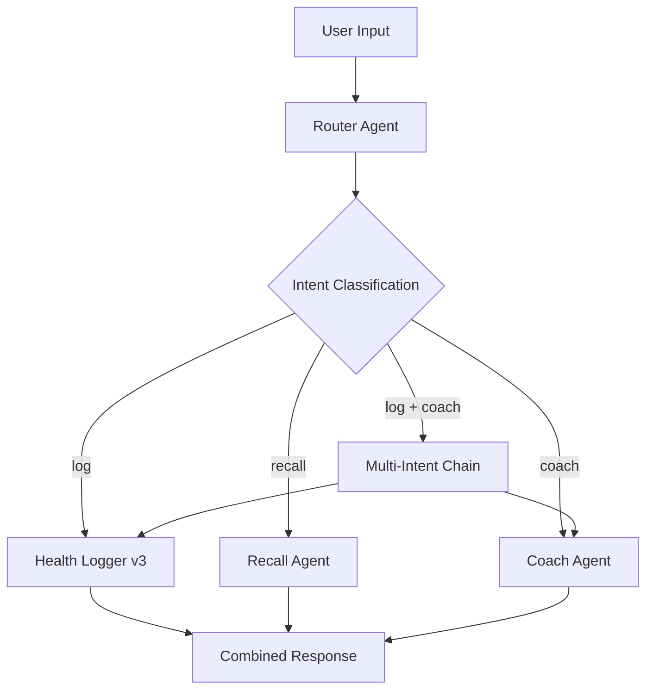

# 🏥 Health Companion - Intelligent AI Health Management System

An advanced, multi-modal health management system built with Agno AI agents and Gradio. This project provides intelligent health logging, data analysis, and personalized coaching through a sophisticated router-based architecture that understands user intent and provides comprehensive health support.

## 🎯 Project Purpose

The Health Companion system is designed to:
- **Intelligently log** health episodes with structured data capture
- **Analyze patterns** in health data to provide insights and correlations  
- **Provide evidence-based coaching** for health management and lifestyle improvements
- **Route complex requests** automatically to the appropriate specialist agents
- **Maintain comprehensive health records** with episodic tracking and intervention logging

This system is particularly focused on **migraine and chronic pain management** but can be extended to other health conditions.

## ✨ System Features

### 🤖 **Intelligent Agent Architecture**
- **Multi-intent routing** with confidence-based decision making
- **Stateful orchestration** for complex, multi-step workflows  
- **Context-aware responses** using conversation history
- **Graceful error handling** with robust fallback mechanisms

### 🏥 **Health Management Capabilities**
- **Structured episode logging** with severity tracking and temporal linking
- **Pattern analysis** and correlation detection across health data
- **Evidence-based coaching** using migraine research handouts
- **Intervention tracking** with effectiveness monitoring
- **Comprehensive audit trails** for all health interactions

### 💻 **User Interface**
- **Multi-modal Input**: Text, microphone (Whisper transcription), and file attachments
- **Agent Selection**: Switch between different specialist agents
- **Real-time Chat**: Interactive conversation flow with health context
- **File Support**: Upload and analyze health-related documents
- **Voice Input**: Record symptoms and updates hands-free
- **Modern UI**: Clean Gradio interface optimized for health workflows

### 🛡️ **Safety & Privacy**
- **Local data storage** with JSON-based health records
- **Medical safety guardrails** preventing inappropriate medical advice
- **Privacy-first design** with no external health data transmission
- **Disclaimer integration** for all health-related responses

## 🤖 Available AI Agents

The Health Companion system includes several specialized agents, each designed for specific health management tasks:

### 🎯 **Health Companion (Auto-Router)** - *Recommended Default*
**The intelligent orchestrator that automatically routes your requests to the right specialist.**

**What it does:**
- Analyzes your message to understand intent (logging, recall, coaching, etc.)
- Routes simple requests directly to the appropriate specialist
- Handles complex multi-intent requests (e.g., "I have a migraine, what should I do?")
- Combines responses from multiple agents for comprehensive care

**Best for:** All health-related conversations, especially complex requests

---

### 📝 **Health Logger (v3)** - *Pure Agno Implementation*
**Structured health data capture with intelligent episode linking.**

**What it does:**
- Extracts structured data from natural language health reports
- Links related symptoms to ongoing episodes (e.g., continuation of a migraine)
- Tracks severity, location, timing, and interventions
- Maintains comprehensive health episode records

**Example:** *"I have a tension headache on the right side, severity 6/10, started 2 hours ago"*
**Best for:** Logging new symptoms, episodes, or health updates

---

### 📊 **Recall Agent** - *Historical Analysis*
**Your personal health data analyst for pattern recognition and historical insights.**

**What it does:**
- Searches your health history by date, condition, or pattern
- Correlates observations with health episodes
- Provides statistical summaries and trend analysis
- Answers questions about frequency, triggers, and patterns

**Example:** *"How often do I get migraines?" or "What were my pain levels last week?"*
**Best for:** Understanding health patterns, trends, and historical data

---

### 🩺 **Coach Agent** - *Evidence-Based Guidance*
**Compassionate health coaching based on migraine research and your current episodes.**

**What it does:**
- Provides non-medication lifestyle and comfort recommendations
- Searches migraine research handouts for evidence-based advice
- Considers your current/recent episodes for personalized guidance
- Includes safety guardrails and medical disclaimers

**Example:** *"What can I do to manage stress-related headaches?"*
**Best for:** Lifestyle advice, comfort measures, and evidence-based health guidance

---

### 🔄 **How the Agents Work Together**

**Simple Request:**
```
"Show me my migraine history" → Auto-Router → Recall Agent → Historical analysis
```

**Complex Request:**
```
"I have a severe migraine, what should I do?" 
→ Auto-Router detects: logging + coaching intents
→ Health Logger: Records the episode  
→ Coach Agent: Provides personalized advice
→ Combined response: Logging confirmation + guidance
```

## 🚀 Quick Start

### 1. Setup Environment

**Option A: Using UV (Recommended)**
```bash
# Activate UV virtual environment (Windows PowerShell)
& d:/AI/AI_agents_agno/uv/Scripts/Activate.ps1
# Or from project root:
.\uv\Scripts\Activate.ps1

# Dependencies are pre-installed in UV environment
# Agno library is already configured
```

**Option B: Standard Python Environment**
```bash
# Create virtual environment
python -m venv .venv

# Activate virtual environment
# On Windows:
.venv\Scripts\activate
# On macOS/Linux:
source .venv/bin/activate

# Install dependencies
pip install agno gradio openai python-dotenv
pip install chromadb  # For Windows-compatible vector storage
pip install unstructured markdown  # For knowledge base functionality
```

### 2. Configure API Keys

```bash
# Create .env file with your API keys
# At minimum, you need:
OPENAI_API_KEY=sk-your-key-here
```

**📝 Note:** The system is configured to use `text-embedding-ada-002` for embeddings, which is more widely accessible than newer embedding models. If your OpenAI API key doesn't have access to embeddings, the Coach Agent will use fallback advice instead of the knowledge base.

### 3. Run the Application

```bash
python app.py
```

The interface will open automatically in your browser at `http://127.0.0.1:7860`

## 📝 Example Usage Scenarios

### 🏥 **Complete Health Management Workflow**

**1. Start with the Auto-Router (Recommended)**
```
Select: "Health Companion (Auto-Router)"
Message: "I have a severe migraine on my right temple, 8/10 pain. What should I do?"

Result: 
→ Logs the migraine episode automatically
→ Provides evidence-based coaching advice  
→ Combined response with both actions
```

**2. Individual Agent Usage**

**Health Logging:**
```
Select: "Health Logger (v3)"
Message: "Woke up with neck pain, 5/10, feels stiff and tight"

Result: Structured episode logged with severity, location, and timing
```

**Historical Analysis:**
```
Select: "Recall Agent"  
Message: "How many migraines did I have last month?"

Result: Statistical analysis with episode counts and patterns
```

**Health Coaching:**
```
Select: "Coach Agent"
Message: "What lifestyle changes help with stress headaches?"

Result: Evidence-based advice from migraine research with safety disclaimers
```

### 🎙️ **Voice Input Examples**
- Record: *"I just took ibuprofen for my headache"*
- Record: *"Pain level has decreased to a 4 out of 10"*
- Record: *"Show me my pain patterns for this week"*

### 📄 **File Upload Support**
- Upload health reports, lab results, or medical documents
- Agents can analyze and incorporate file content into health records
- Supported formats: PDF, images, text documents

## 🎯 **Getting Started Tips**

1. **Start Simple**: Begin with "Health Companion (Auto-Router)" for all interactions
2. **Be Descriptive**: Include severity (1-10), location, timing, and triggers when logging symptoms  
3. **Ask Questions**: The Recall Agent can help you understand patterns and trends
4. **Get Guidance**: The Coach Agent provides safe, evidence-based lifestyle advice
5. **Natural Language**: No need for special commands - speak naturally about your health

## 🛠️ Configuration

### Environment Variables

Create a `.env` file in the project root:

```env
# Required - OpenAI API for agents and embeddings
OPENAI_API_KEY=sk-your-openai-api-key
```

**💡 Tips:**
- The system uses `text-embedding-ada-002` for better compatibility
- `gpt-4o-mini-2024-07-18` is used for all agent models for cost efficiency
- Only OpenAI API key is required - other services are optional

### Data Storage

Health data is stored locally in JSON files:
- `data/episodes.json` - Health episodes and interventions
- `data/observations.json` - Routine health observations  
- `data/events.jsonl` - Complete audit trail of all interactions
- `data/chroma_coach/` - ChromaDB vector database for knowledge base

## 🏗️ Project Architecture

### **Layered Architecture**
```
📁 health_advisor/          # Health management layer
├── router/                 # Intent routing and orchestration  
├── coach/                  # Evidence-based health coaching
├── recall/                 # Historical data analysis
└── knowledge/              # Knowledge base management

📁 healthlogger/            # Health data capture workflow
├── agents.py               # Extractor and Reply agents
├── workflow.py             # Pure Agno workflow orchestration
├── workflow_steps.py       # Deterministic processing logic
└── prompts.py              # LLM instructions and examples

📁 core/                    # Shared business logic
├── ontology.py             # Health condition normalization
├── policies.py             # Application-wide constants
└── timeutils.py            # Date/time utilities

📁 data/                    # Data persistence layer
├── json_store.py           # JSON-based storage implementation
├── storage_interface.py    # Abstract storage contracts
└── schemas/                # Pydantic data models
```

### **Agent Workflow Architecture**

**Router-Based Orchestration:**


**Pure Agno Implementation:**
- Uses Agno's `Agent`, `Workflow`, `Step` primitives
- Structured outputs with Pydantic models
- Tool-based architecture with `@tool` decorators
- ChromaDB for Windows-compatible vector storage

## 🔍 Troubleshooting

### Common Issues

**Environment Setup:**
- **"Agno imports failed"**: Activate UV environment or install with `pip install agno`
- **"ChromaDB import error"**: Install with `pip install chromadb`
- **"Knowledge base loading failed"**: Install with `pip install unstructured markdown`

**API & Functionality:**
- **"Audio transcription disabled"**: Set valid `OPENAI_API_KEY` in `.env` file
- **"Coach Agent using fallback advice"**: Check embeddings API access for text-embedding-ada-002
- **"No health data found"**: Use Health Logger first to create episode data

**Windows Compatibility:**
- **Vector database errors**: System uses ChromaDB for Windows compatibility
- **File path issues**: Use forward slashes or raw strings in file paths
- **Permission errors**: Run PowerShell as administrator if needed

### Performance Tips

- **Use Auto-Router**: Start with "Health Companion (Auto-Router)" for best experience
- **Batch Related Requests**: Include multiple questions in one message for efficient processing
- **Specific Descriptions**: Detailed symptom descriptions improve data quality
- **Regular Usage**: Consistent logging improves pattern recognition and coaching relevance

## 📦 Key Dependencies

- **`agno`** - Pure Agno AI framework implementation
- **`gradio`** - Web UI framework for chat interface  
- **`openai`** - For GPT models and Whisper transcription
- **`chromadb`** - Windows-compatible vector database
- **`unstructured`** - Document processing for knowledge base
- **`pydantic`** - Data validation and structured outputs

## 🏥 Health Data & Privacy

**Local Storage Only:**
- All health data stored locally in JSON files
- No external health data transmission  
- Complete user control over personal health information
- HIPAA-friendly local-only architecture

**Medical Disclaimers:**
- System provides lifestyle and comfort advice only
- Not a substitute for professional medical care
- Always includes appropriate medical disclaimers
- Safety guardrails prevent inappropriate medical recommendations

## 🤝 Contributing

We welcome contributions to improve the Health Companion system:

1. Fork the repository
2. Create a feature branch (`git checkout -b feature/amazing-feature`)
3. Make your changes following Agno best practices
4. Test thoroughly with health scenarios
5. Update documentation as needed
6. Submit a pull request

**Areas for Contribution:**
- Additional health condition support beyond migraines
- Enhanced data analysis and visualization
- Integration with wearable devices or health APIs
- Improved coaching content and knowledge bases
- Multi-language support for international users

## 📄 License & Acknowledgments

This project is built with the [Agno AI framework](https://docs.agno.com/) and follows open-source principles for health technology accessibility.

**Acknowledgments:**
- **Agno Team** - For the exceptional AI agent framework
- **Gradio Team** - For the intuitive web interface framework  
- **OpenAI** - For GPT models and Whisper transcription
- **ChromaDB** - For Windows-compatible vector storage
- **Medical Research Community** - For evidence-based migraine treatment guidelines

**Health Data Ethics:**
This project prioritizes user privacy, data ownership, and medical safety in all health technology implementations.

## 🔗 Additional Resources

- **[Agno Documentation](https://docs.agno.com/)** - Framework documentation and guides
- **[Agno GitHub](https://github.com/agnoinc/agno)** - Source code and examples
- **[Gradio Documentation](https://gradio.app/docs/)** - UI framework documentation
- **[OpenAI API Documentation](https://platform.openai.com/docs/)** - AI model documentation

---

**🏥 Built for Better Health Management - Privacy First, Evidence-Based, AI-Powered** 🤖✨